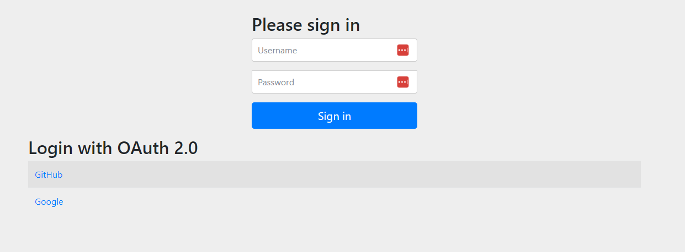

# LoginOAuth-Github-Google  

For test, run the app and connect to the local host.  
[localhost](http://localhost:8080/login)  

You need to specify you OAuth app's ```Client ID``` and ```Client secrets``` in the ```application.properties``` file.  

For Github you can find instructions her : [OAuth App](https://github.com/settings/applications/new)  
And the documentation her: [Doc](https://docs.github.com/en/apps/oauth-apps/building-oauth-apps/authorizing-oauth-apps)

Here's the login page screenshot:  
